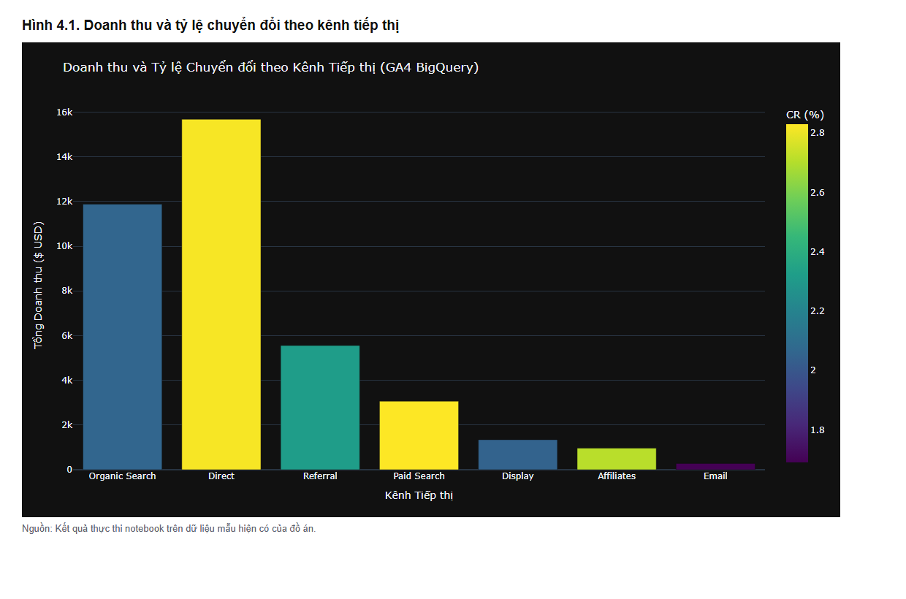
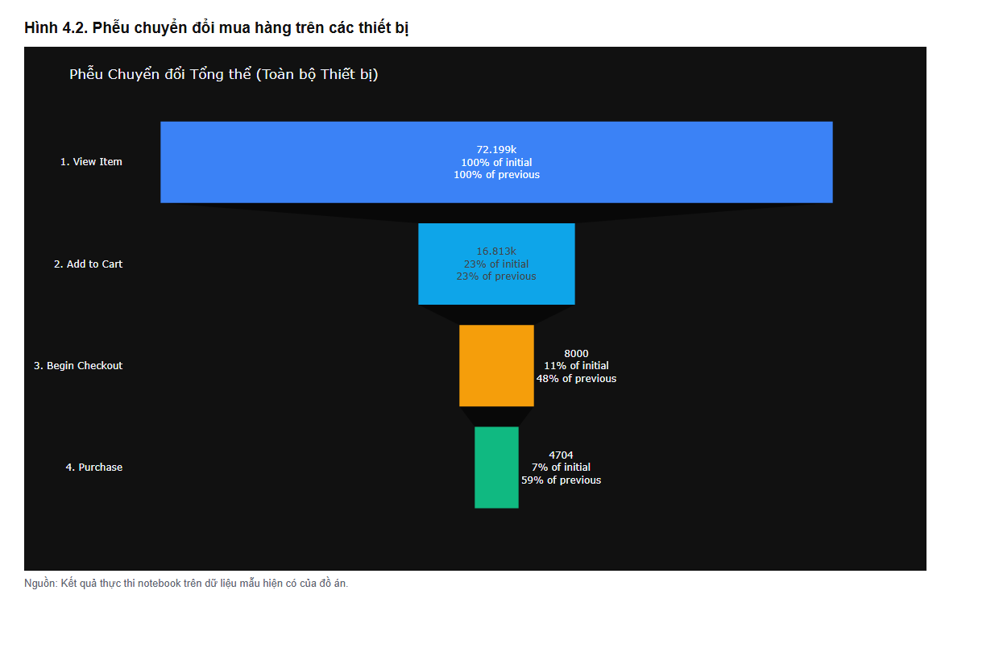
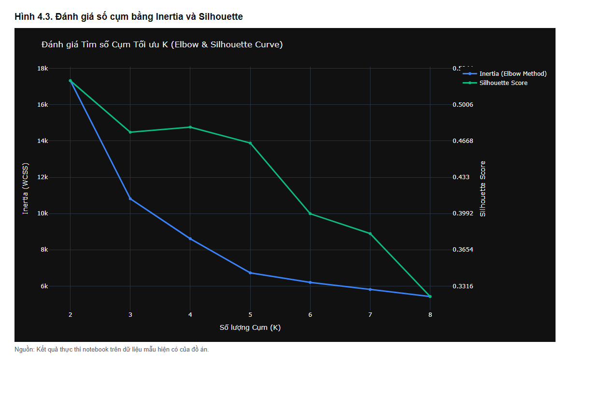
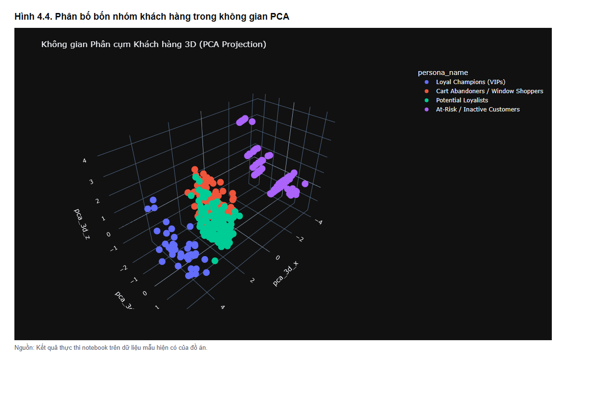
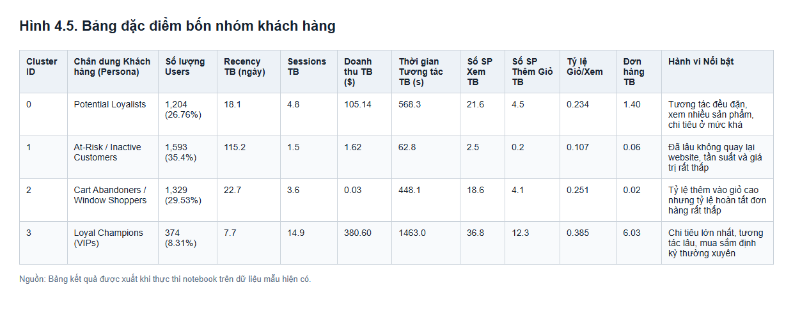
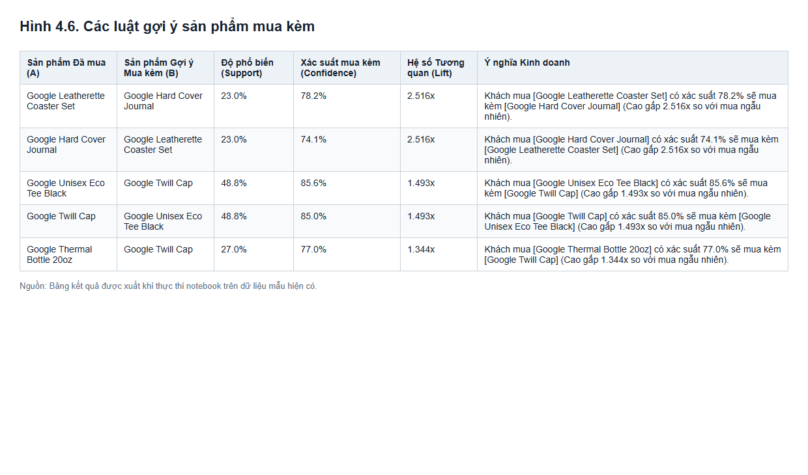

# CHƯƠNG 4. KẾT QUẢ THỰC NGHIỆM VÀ ĐÁNH GIÁ

## 4.1. Môi trường và phạm vi thực nghiệm

Quy trình phân tích được thực hiện bằng Python với các thư viện Pandas, NumPy, Scikit-learn và Plotly. Phần truy vấn dữ liệu được thiết kế cho Google BigQuery; các kết quả sau truy vấn được dùng để phân tích thống kê, xây dựng phễu mua hàng, phân cụm khách hàng và tìm luật kết hợp sản phẩm. Hai notebook phân tích của đồ án đã được chạy hết các ô để kiểm tra quy trình và tạo biểu đồ minh họa cho chương này.

Trong lần thực nghiệm này, môi trường không có thông tin xác thực Google Cloud. Vì vậy, notebook đọc dữ liệu đã lưu trong bộ nhớ đệm của dự án. Đây là dữ liệu mẫu phục vụ chạy ngoại tuyến, gồm 7 nhóm kênh tiếp thị, 3 nhóm thiết bị, 4.500 hồ sơ người dùng và 1.443 dòng sản phẩm trong giao dịch. Các kết quả dưới đây phản ánh **bộ dữ liệu mẫu đang sử dụng**, không được xem là số liệu đã truy vấn trực tiếp từ toàn bộ bộ dữ liệu GA4 công khai.

Các bảng dữ liệu mẫu phục vụ từng bài phân tích được tạo riêng. Do đó, số giao dịch trong bảng tổng quan và số người dùng mua hàng trong bảng phễu không nên cộng hoặc đối chiếu như thể chúng xuất phát từ cùng một tập giao dịch đã được kiểm tra đối soát.

## 4.2. Kết quả phân tích dữ liệu khám phá

### 4.2.1. Hiệu quả theo kênh tiếp thị

Kết quả thống kê cho thấy **Organic Search** có số người dùng cao nhất với 9.226 lượt người dùng được ghi nhận theo kênh, tiếp theo là **Direct** với 5.243. Xét theo doanh thu, thứ tự thay đổi: Direct đạt 15.678,71 USD và đứng đầu, còn Organic Search đạt 11.879,94 USD. Điều này cho thấy kênh có lượng truy cập cao nhất chưa chắc tạo ra doanh thu cao nhất.

| Kênh tiếp thị | Người dùng | Đơn hàng | Doanh thu (USD) | Tỷ lệ chuyển đổi |
| --- | ---: | ---: | ---: | ---: |
| Organic Search | 9.226 | 225 | 11.879,94 | 2,06% |
| Direct | 5.243 | 195 | 15.678,71 | 2,82% |
| Referral | 2.605 | 78 | 5.556,55 | 2,32% |
| Paid Search | 1.681 | 59 | 3.066,51 | 2,83% |

Trong bốn kênh nêu trên, Paid Search có tỷ lệ chuyển đổi nhỉnh hơn Direct nhưng quy mô người dùng và doanh thu thấp hơn. Vì vậy, khi đánh giá hiệu quả tiếp thị, cần xem đồng thời lưu lượng, số đơn hàng và doanh thu thay vì chỉ dựa vào một tỷ lệ riêng lẻ.

*Hình 4.1. Doanh thu và tỷ lệ chuyển đổi theo kênh tiếp thị trên dữ liệu thực nghiệm.*

### 4.2.2. Nhận xét về dữ liệu tổng quan

Biểu đồ cho thấy doanh thu phân bố không đều giữa các kênh. Direct và Organic Search đóng góp phần lớn doanh thu trong bộ dữ liệu đang xét, trong khi Email có quy mô nhỏ nhất. Kết quả này gợi ý rằng việc cải thiện hiệu quả từng kênh nên dựa trên vai trò của kênh: có kênh phù hợp để thu hút người dùng mới, có kênh tạo ra nhiều giao dịch hơn. Đây mới là nhận xét từ dữ liệu mô tả; đồ án chưa thực hiện thí nghiệm để xác định nguyên nhân hoặc đo tác động của một chiến dịch tiếp thị cụ thể.

## 4.3. Kết quả phân tích phễu mua hàng

### 4.3.1. Phễu chuyển đổi tổng thể

Phễu thực nghiệm gồm bốn bước: xem sản phẩm, thêm vào giỏ, bắt đầu thanh toán và mua hàng. Tổng số người dùng được ghi nhận tại từng bước lần lượt là **72.199**, **16.813**, **8.000** và **4.704**. Mức giảm lớn nhất về số lượng nằm giữa bước xem sản phẩm và thêm vào giỏ: khoảng 76,7% người đã xem sản phẩm không xuất hiện ở bước thêm giỏ theo cách tính của phễu.

*Hình 4.2. Số người dùng tại bốn bước của phễu mua hàng trên dữ liệu thực nghiệm.*

Tỷ lệ chuyển đổi từ xem sản phẩm đến mua hàng đạt khoảng **6,52%**. Nếu lấy những người đã thêm sản phẩm vào giỏ làm mốc, khoảng **72,02%** chưa được ghi nhận ở bước mua hàng. Hai tỷ lệ này có mẫu số khác nhau nên cần được trình bày và diễn giải riêng.

### 4.3.2. So sánh theo thiết bị

Thiết bị desktop có 38.000 người xem sản phẩm và 3.800 người mua hàng, tương ứng tỷ lệ chuyển đổi tổng thể **10,00%**. Trên mobile, các con số là 31.159 và 824, tương ứng **2,64%**. Tỷ lệ bỏ giỏ trên mobile đạt **84,89%**, cao hơn desktop (**64,91%**) gần 20 điểm phần trăm.

| Thiết bị | Xem sản phẩm | Thêm giỏ | Bắt đầu thanh toán | Mua hàng | Chuyển đổi tổng thể | Bỏ giỏ |
| --- | ---: | ---: | ---: | ---: | ---: | ---: |
| Desktop | 38.000 | 10.829 | 5.847 | 3.800 | 10,00% | 64,91% |
| Mobile | 31.159 | 5.452 | 1.962 | 824 | 2,64% | 84,89% |
| Tablet | 3.040 | 532 | 191 | 80 | 2,63% | 84,96% |

Sự chênh lệch này cho thấy nhóm thiết bị di động cần được xem xét kỹ hơn, đặc biệt ở giai đoạn từ thêm giỏ đến thanh toán. Tuy nhiên, dữ liệu hiện tại chỉ cho biết **mức chênh lệch**, chưa đủ để khẳng định nguyên nhân là giao diện, phí vận chuyển hay phương thức thanh toán. Những nguyên nhân đó cần được kiểm tra bằng dữ liệu bổ sung hoặc thử nghiệm người dùng.

Một giới hạn khác là phễu được tính theo sự xuất hiện của các loại sự kiện ở từng người dùng, chưa kiểm tra thứ tự thời gian của toàn bộ sự kiện. Vì vậy, kết quả nên được hiểu là phễu dựa trên điều kiện có đủ hành vi ở mỗi bước.

## 4.4. Kết quả phân cụm khách hàng

### 4.4.1. Đánh giá số lượng cụm

Sau khi tiền xử lý 4.500 hồ sơ người dùng với chín đặc trưng RFM và hành vi, mô hình K-Means được đánh giá từ **K = 2 đến K = 8**. Inertia giảm khi số cụm tăng, còn silhouette score cao nhất ở **K = 2**, đạt **0,5230**. Với **K = 4**, silhouette score đạt **0,4797**.

*Hình 4.3. Inertia và silhouette score ứng với các giá trị K từ 2 đến 8.*

Như vậy, **K = 4 không phải phương án có silhouette score cao nhất** trong lần chạy này. Đồ án chọn K = 4 vì muốn mô tả bốn nhóm hành vi có ý nghĩa khi đưa ra nhận xét kinh doanh. Đây là sự lựa chọn cân bằng giữa khả năng phân tách của mô hình và khả năng diễn giải kết quả, không phải kết luận rằng K = 4 tối ưu theo mọi chỉ số.

### 4.4.2. Đặc điểm bốn nhóm khách hàng

Kết quả phân cụm chia 4.500 hồ sơ thành bốn nhóm. Nhóm khách hàng trung thành có giá trị cao chiếm **8,31%** và có chi tiêu trung bình **380,60 USD/người**, cao nhất trong bốn nhóm. Nhóm ít hoạt động chiếm **35,40%**, có thời gian từ lần tương tác cuối trung bình **115,2 ngày** và mức chi tiêu trung bình thấp nhất sau nhóm bỏ giỏ.

| Nhóm khách hàng | Số người dùng | Tỷ trọng | Số phiên trung bình | Chi tiêu trung bình (USD) | Đặc điểm đáng chú ý |
| --- | ---: | ---: | ---: | ---: | --- |
| Trung thành, giá trị cao | 374 | 8,31% | 14,9 | 380,60 | Quay lại thường xuyên và mua nhiều lần. |
| Tiềm năng | 1.204 | 26,76% | 4,8 | 105,14 | Tương tác đều, đã phát sinh mua hàng. |
| Xem hàng, bỏ giỏ | 1.329 | 29,53% | 3,6 | 0,03 | Xem và thêm giỏ nhiều nhưng rất ít mua. |
| Ít hoạt động | 1.593 | 35,40% | 1,5 | 1,62 | Đã lâu không tương tác, tần suất thấp. |

Để quan sát kết quả, dữ liệu được giảm từ chín chiều xuống ba chiều bằng PCA. Ba thành phần chính giải thích khoảng **91,10%** phương sai của bộ đặc trưng đã chuẩn hóa. Biểu đồ cho thấy các nhóm có xu hướng tập trung tại những vùng khác nhau; tuy nhiên, đây là hình chiếu của dữ liệu nên không thay thế việc đánh giá mô hình trên không gian chín chiều ban đầu.

*Hình 4.4. Mẫu 500 người dùng được biểu diễn trong không gian PCA ba chiều.*

*Hình 4.5. Bảng đặc điểm bốn nhóm khách hàng được xuất khi chạy notebook.*

## 4.5. Kết quả phân tích sản phẩm mua kèm

Sau khi tạo ma trận giỏ hàng, có **560 giao dịch** chứa ít nhất hai sản phẩm hợp lệ và **8 sản phẩm** được đưa vào phân tích. Thuật toán tìm được **12 tập sản phẩm phổ biến** và **8 luật kết hợp** thỏa điều kiện về support, confidence và lift.

Luật nổi bật nhất là: khi một đơn hàng có **Google Leatherette Coaster Set**, đơn hàng đó cũng có **Google Hard Cover Journal** với confidence **78,18%**. Cặp này xuất hiện trong **23,04%** số giao dịch được xét và có lift **2,516**. Kết quả cho thấy hai sản phẩm đi cùng nhau nhiều hơn mức kỳ vọng nếu việc mua chúng độc lập.

| Sản phẩm đã có trong đơn | Sản phẩm gợi ý mua kèm | Support | Confidence | Lift |
| --- | --- | ---: | ---: | ---: |
| Google Leatherette Coaster Set | Google Hard Cover Journal | 23,04% | 78,18% | 2,516 |
| Google Unisex Eco Tee Black | Google Twill Cap | 48,75% | 85,58% | 1,493 |
| Google Thermal Bottle 20oz | Google Twill Cap | 26,96% | 77,04% | 1,344 |

*Hình 4.6. Các luật gợi ý sản phẩm mua kèm được xuất khi chạy notebook.*

Những luật này có thể dùng để đề xuất vị trí hiển thị sản phẩm mua kèm. Dù vậy, lift và confidence chỉ phản ánh mối liên hệ trong bộ giao dịch đã phân tích; chúng chưa chứng minh rằng việc hiển thị gợi ý sẽ làm doanh thu tăng. Để đánh giá tác động kinh doanh, cần thử nghiệm gợi ý với người dùng và theo dõi tỷ lệ mua thực tế.

## 4.6. Đánh giá chung và giới hạn thực nghiệm

Lần chạy thực nghiệm cho thấy quy trình phân tích có thể hoàn thành các bước khám phá dữ liệu, lập phễu mua hàng, phân cụm khách hàng và tìm cặp sản phẩm mua kèm. Các biểu đồ giúp nhận ra sự khác biệt giữa kênh tiếp thị, thiết bị và nhóm khách hàng. Bốn nhóm từ K-Means có thể diễn giải bằng các chỉ số trung bình về hoạt động và chi tiêu.

Tuy nhiên, kết quả chương này được tạo từ **dữ liệu mẫu ngoại tuyến**. Các bảng mẫu chưa được đối soát để bảo đảm mọi chỉ số thuộc cùng một tập giao dịch thống nhất. Ngoài ra, phễu chưa xét thứ tự thời gian của sự kiện; K = 4 không đạt silhouette score cao nhất; và các luật mua kèm chưa được đánh giá bằng thử nghiệm kinh doanh. Do đó, giá trị chính của thực nghiệm là minh họa quy trình và khả năng phân tích của hệ thống. Để đưa ra kết luận về hoạt động thực tế của cửa hàng, cần chạy lại toàn bộ truy vấn trên một phạm vi dữ liệu gốc thống nhất rồi đánh giá các kết quả thu được.

Notebook tổng hợp cũng đã được chạy riêng trong chế độ ngoại tuyến. Ở chế độ đó, chương trình tự tạo **1.000 hồ sơ người dùng** với cách sinh dữ liệu khác. Silhouette score của K = 4 chỉ đạt **0,1186** và ba thành phần PCA giải thích **36,13%** phương sai. Hai kết quả này khác rõ rệt với thực nghiệm 4.500 hồ sơ trình bày ở trên, vì vậy không được gộp chung để đưa ra một kết luận về chất lượng mô hình. Kết quả này cho thấy độ phù hợp của các nhóm khách hàng phụ thuộc nhiều vào dữ liệu đầu vào và cần được kiểm tra lại trên dữ liệu gốc.
